<p align="center">
  <picture>
    <source srcset="assets/flowformer-dark.png" media="(prefers-color-scheme: dark)">
    <source srcset="assets/flowformer-light.png" media="(prefers-color-scheme: light)">
    
  </picture>
</p>

Flowformer is a flow matching-based language model that predicts tokens by integrating in embedding space. Instead of directly predicting and autoregressing logits, Diffformer gradually refines the pre-logit embeddings before projecting to logits and sampling.

## Architecture




---

## 🔧 Setup (via [PDM](https://pdm-project.org/en/latest/))


```bash
pdm install
```

To run the training script:

```bash
pdm run python train.py
```

To recreate graphs and charts

```bash
pdm run python test.py
```

